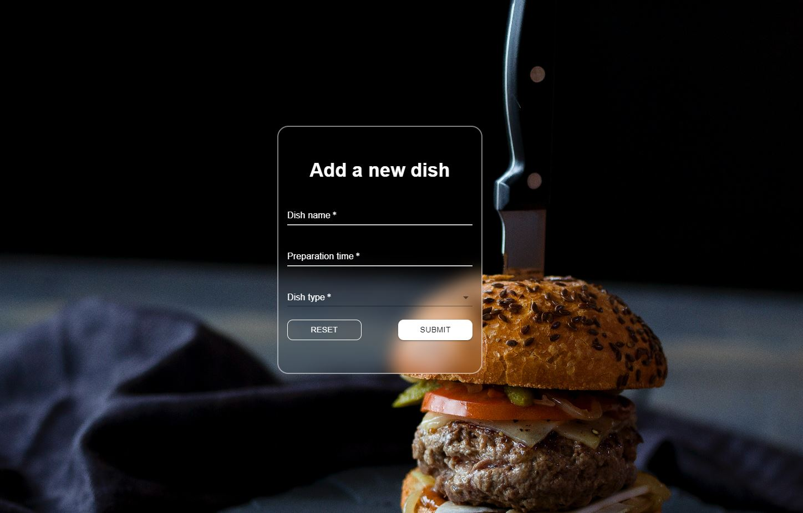

# HexOcean form
 
## 🔍 Project overview 
The project is a solution to HexOcean recruitment task. It is a form used to add a new dish and send it to the API endpoint via 'POST' method. For the project I used Next.js. For the form component I used MUI components and for custom styling CSS modules (to override some default MUI styles). The form and each form field is validated and some form fields are displayed conditionally.

 
## 📦 Tech stack:
- React  - Next.js 13.3.0
- MUI + CSS Modules
- npm 8.19.3
- Node.js - 16.19.0

 
## 💻 Demo

Click the link and check the demo app: [link](https://hexocean-form.vercel.app/)

## 💾 Installation

`git clone https://github.com/marcinsuski/hexocean-form.git`  
`npm install`  
`npm run dev`  

## 🧙‍♂️ Author
- GitHub - [Marcin Suski](https://github.com/marcinsuski)
- LinkedIn - [marcin-suski](https://www.linkedin.com/in/marcin-suski/)
- Porftolio - [marcinsuski.pl](https://marcinsuski.pl)
